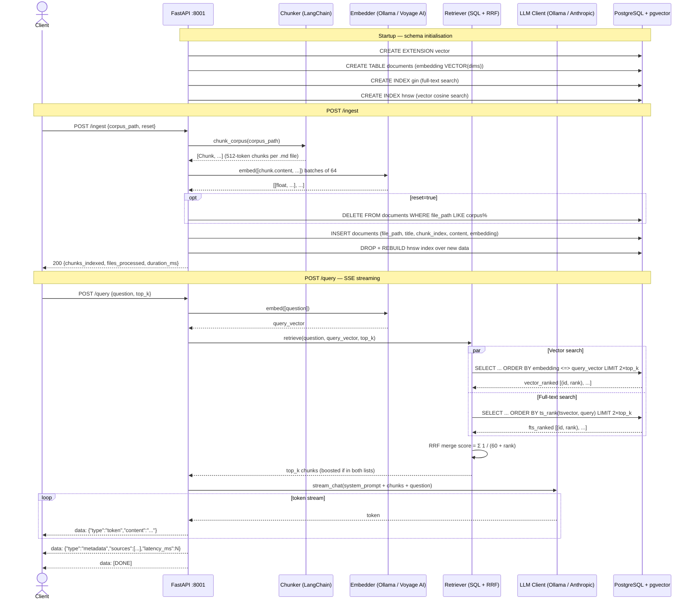

# docu-rag

A production-grade RAG (Retrieval-Augmented Generation) API. Point it at any folder of markdown documents and ask questions in plain English — it returns grounded, streaming answers with source attribution.

Built with **Python · FastAPI · LangChain · pgvector · Ollama**.

> **Live demo:** https://docu-rag.onrender.com

---

## Features

- **Hybrid search** — combines vector similarity (pgvector) and full-text search (`ts_rank`) via Reciprocal Rank Fusion (RRF) for higher recall than either method alone
- **Streaming responses** — answers stream token-by-token via SSE; no waiting for the full response
- **Source attribution** — every answer includes the exact chunks and files used to generate it
- **Works offline** — defaults to [Ollama](https://ollama.ai) (local LLM + embeddings); no API key required
- **Pluggable corpus** — ingest any markdown folder via a single API call
- **Anthropic API** — optional override for higher-quality responses (`claude-haiku-4-5-20251001` + `voyage-3`)

---

## Quick Start

### Prerequisites

- Docker + Docker Compose
- [Ollama](https://ollama.ai) running locally with the required models pulled:

```bash
ollama pull llama3.2
ollama pull nomic-embed-text
```

### Run

```bash
git clone https://github.com/thanhnv2210/docu-rag.git
cd docu-rag
cp .env.example .env
docker compose up --build
```

API is available at `http://localhost:8001`. Interactive OpenAPI docs at `http://localhost:8001/docs`.

### Ingest the demo corpus

```bash
curl -s -X POST http://localhost:8001/ingest \
  -H "Content-Type: application/json" \
  -d '{"corpus_path": "corpus/fintech-demo", "reset": true}' | jq
```

```json
{
  "chunks_indexed": 148,
  "files_processed": 7,
  "duration_ms": 3241
}
```

### Ask a question

```bash
curl -s -X POST http://localhost:8001/query \
  -H "Content-Type: application/json" \
  -N \
  -d '{"question": "What retry policy applies when ArcaPay returns a timeout?", "top_k": 5}'
```

Response streams as SSE:

```
data: {"type": "token", "content": "When ArcaPay returns"}
data: {"type": "token", "content": " a TIMEOUT error,"}
data: {"type": "token", "content": " the platform applies..."}
...
data: {"type": "metadata", "sources": [
  {"file_path": "corpus/fintech-demo/resilience-patterns.md", "chunk_index": 2, "title": "Retry Policy"},
  {"file_path": "corpus/fintech-demo/payment-hub-integrations.md", "chunk_index": 5, "title": "ArcaPay"}
], "latency_ms": 1840, "tokens_used": 287, "provider": "ollama"}
data: [DONE]
```

---

## Architecture

```
┌──────────────────────────────────────────────────────────────┐
│                         Client                               │
│            (curl / any HTTP client / React frontend)         │
└──────────────────────┬───────────────────────────────────────┘
                       │  REST + SSE
┌──────────────────────▼───────────────────────────────────────┐
│                      FastAPI (port 8001)                      │
│                                                              │
│   POST /ingest          POST /query         GET /health      │
│         │                    │                               │
│    ┌────▼────┐          ┌────▼──────┐                        │
│    │ Chunker │          │ Retriever │                        │
│    │LangChain│          │Hybrid SQL │                        │
│    └────┬────┘          └────┬──────┘                        │
│         │                    │                               │
│    ┌────▼────┐          ┌────▼──────┐                        │
│    │Embedder │          │LLM Client │──── SSE token stream   │
│    └────┬────┘          └────┬──────┘                        │
└─────────┼────────────────────┼──────────────────────────────┘
          │                    │
          │            ┌───────▼────────────┐
          │            │  Ollama (default)  │
          │            │  or Anthropic API  │
          │            └────────────────────┘
          │
┌─────────▼──────────────────────────────────────────────────┐
│                  PostgreSQL 16 + pgvector                   │
│                                                            │
│  Table: documents                                          │
│  ├── content (TEXT)           ← GIN full-text index        │
│  ├── embedding (VECTOR(dims)) ← HNSW cosine index          │
│  └── metadata (JSONB)                                      │
└────────────────────────────────────────────────────────────┘
```

### Data flow



> Full PlantUML source: [`docs/data-flow.puml`](docs/data-flow.puml)

### How hybrid search works

1. **Embed** the question → 768-dim query vector
2. **Two parallel searches:**
   - Vector search — cosine distance (`embedding <=> query_vector`), top 2k candidates
   - Keyword search — full-text rank (`ts_rank`), top 2k candidates
3. **RRF merge** — `score = 1/(60 + rank)` summed across both lists; chunks appearing in both lists are boosted
4. **Prompt** — top-k chunks injected as context; LLM answer streamed back token-by-token

---

## API Reference

| Endpoint | Method | Description |
|---|---|---|
| `/ingest` | POST | Index a markdown corpus into pgvector |
| `/query` | POST | Ask a question; streams SSE token events |
| `/health` | GET | Health check + live vector count |
| `/docs` | GET | Interactive OpenAPI UI (Swagger) |

### POST /ingest

```json
// Request
{ "corpus_path": "corpus/fintech-demo", "reset": false }

// Response
{ "chunks_indexed": 148, "files_processed": 7, "duration_ms": 3241 }
```

`reset: true` deletes all existing chunks for this corpus path before re-indexing.

### POST /query (SSE)

```json
// Request
{ "question": "How does the circuit breaker interact with hub routing?", "top_k": 5 }
```

Returns `Content-Type: text/event-stream`. Events:
- `{"type": "token", "content": "..."}` — one per generated token
- `{"type": "metadata", "sources": [...], "latency_ms": N, "tokens_used": N, "provider": "ollama"}` — after final token
- `[DONE]` — stream terminator

### GET /health

```json
{
  "status": "ok",
  "vector_count": 148,
  "provider": "ollama",
  "embed_model": "nomic-embed-text",
  "llm_model": "llama3.2"
}
```

---

## Configuration

Copy `.env.example` to `.env` and edit as needed.

| Variable | Default | Description |
|---|---|---|
| `DATABASE_URL` | (required) | asyncpg PostgreSQL connection string |
| `LLM_PROVIDER` | `ollama` | `ollama` or `anthropic` |
| `OLLAMA_BASE_URL` | `http://localhost:11434` | Ollama server URL. Use `http://host.docker.internal:11434` when running inside Docker on macOS/Windows |
| `OLLAMA_LLM_MODEL` | `llama3.2` | Ollama chat model |
| `OLLAMA_EMBED_MODEL` | `nomic-embed-text` | Ollama embedding model (768 dims) |
| `ANTHROPIC_API_KEY` | _(optional)_ | Required if `LLM_PROVIDER=anthropic` |
| `VOYAGE_API_KEY` | _(optional)_ | Required if `LLM_PROVIDER=anthropic` (voyage-3 embeddings) |
| `EMBED_DIMS` | `768` | Must match embedding model output dims |
| `CHUNK_SIZE` | `512` | Max tokens per chunk |
| `CHUNK_OVERLAP` | `50` | Overlap tokens between consecutive chunks |
| `TOP_K` | `5` | Chunks retrieved per query |
| `LOG_LEVEL` | `INFO` | Python log level (`DEBUG`, `INFO`, `WARNING`, `ERROR`) |
| `LOG_FILE` | `logs/app.log` | Path to the rotating log file (10 MB per file, 5 backups) |

### Switch to Anthropic

```bash
# .env
LLM_PROVIDER=anthropic
ANTHROPIC_API_KEY=sk-ant-...
VOYAGE_API_KEY=pa-...
EMBED_DIMS=1024
```

Restart the container. Re-ingest your corpus — embedding dimensions changed.

---

## Demo Corpus

`corpus/fintech-demo/` ships with the repo — fictional documentation for a payment platform called **FinPay**. No real company names, real endpoints, or proprietary data appear anywhere.

| File | Content |
|---|---|
| `system-overview.md` | 8 microservices, 3 payment hubs, Kafka event bus |
| `transaction-state-machine.md` | Full state lifecycle + failure handling |
| `payment-hub-integrations.md` | ArcaPay, SwiftHub, LocalPay — error codes, retry overrides |
| `database-schema.md` | PostgreSQL schema — 6 tables with DDL |
| `api-reference.md` | REST endpoints, auth, webhooks |
| `resilience-patterns.md` | Retry policy, circuit breaker, idempotency, DLQ |
| `deployment-runbook.md` | Kubernetes, env vars, rollback, alerting |

**Try these multi-hop queries after ingesting:**

```bash
# Requires joining payment-hub-integrations.md + resilience-patterns.md
"What retry policy applies when ArcaPay returns a timeout?"

# Spans transaction-state-machine.md + resilience-patterns.md
"How does FinPay handle a payment that times out during hub submission?"

# Requires database-schema.md + system-overview.md
"What indexes exist on the transactions table and why?"
```

---

## Deploy to Render

[](https://render.com/deploy?repo=https://github.com/thanhnv2210/docu-rag)

The included `render.yaml` configures a free-tier Docker web service + managed PostgreSQL.

**One-time setup before deploying:**

1. Fork this repo.
2. In the Render dashboard, set two secret environment variables:
   - `ANTHROPIC_API_KEY` — your Anthropic API key
   - `VOYAGE_API_KEY` — your Voyage AI API key
3. Click Deploy.

After deploy, seed the demo corpus:

```bash
curl -X POST https://<your-app>.onrender.com/ingest \
  -H "Content-Type: application/json" \
  -d '{"corpus_path": "corpus/fintech-demo", "reset": true}'
```

> **Note:** Render's managed PostgreSQL supports the `pgvector` extension. The app enables it automatically on startup via `CREATE EXTENSION IF NOT EXISTS vector`. The live demo uses `LLM_PROVIDER=anthropic` (`claude-haiku-4-5-20251001` + `voyage-3`) since Ollama cannot run on Render's infrastructure.

---

## Observability

The app writes structured logs to both stdout (captured by `docker logs`) and a rotating file at `logs/app.log` on the host.

**Log format:**
```
2026-07-30 09:59:55,000 INFO access — GET /health 200 7ms client="192.168.0.1"
2026-07-30 09:59:54,257 INFO app.main — docu-rag started | provider=ollama | embed_dims=768
```

Every HTTP request is logged by the `access` logger with method, path, status code, duration, and client IP. Application events (startup, ingest, errors) use their module's logger name.

```bash
# Tail the live log
tail -f logs/app.log

# Filter access logs only
grep " access " logs/app.log

# Filter errors
grep " ERROR " logs/app.log
```

Rotation: 10 MB per file, 5 backups kept (`app.log`, `app.log.1` … `app.log.5`).

---

## Development

```bash
python -m venv .venv && source .venv/bin/activate
pip install -r requirements.txt -r requirements-dev.txt

# Start PostgreSQL with pgvector (if not using Docker Compose)
# Update DATABASE_URL in .env to point to your local instance

# Run the app
uvicorn app.main:app --reload --port 8001

# Lint
ruff check .

# Type check
mypy app/

# Run tests (unit tests only — no DB required)
pytest tests/test_chunker.py tests/test_retriever.py -v

# Run all tests (requires DATABASE_URL)
pytest tests/ -v
```

---

## Project Structure

```
app/
├── main.py             # FastAPI app factory + lifespan
├── config.py           # Settings (pydantic-settings, reads .env)
├── api/
│   ├── health.py       # GET /health
│   ├── ingest.py       # POST /ingest
│   └── query.py        # POST /query (SSE)
├── services/
│   ├── chunker.py      # Markdown-aware text splitter
│   ├── embedder.py     # Embedder ABC + Ollama + Voyage implementations
│   ├── retriever.py    # Hybrid search: pgvector + FTS → RRF
│   └── llm.py          # LLMClient ABC + Ollama + Anthropic implementations
├── db/
│   ├── connection.py   # asyncpg pool lifecycle
│   └── schema.py       # DDL: extension, table, indexes
└── models/
    └── schemas.py      # Pydantic v2 request/response models
corpus/
└── fintech-demo/       # 7 fictional FinPay documentation files
tests/
├── conftest.py         # Fixtures, mock providers, skip markers
├── test_chunker.py     # Unit tests (no external deps)
├── test_retriever.py   # Unit tests (mocked asyncpg)
└── test_api.py         # Integration tests (requires DATABASE_URL)
logs/
└── app.log             # Rotating application + access log (gitignored)
docs/
└── decisions/          # ADR-001, PDR-001
```

---

## License

MIT
